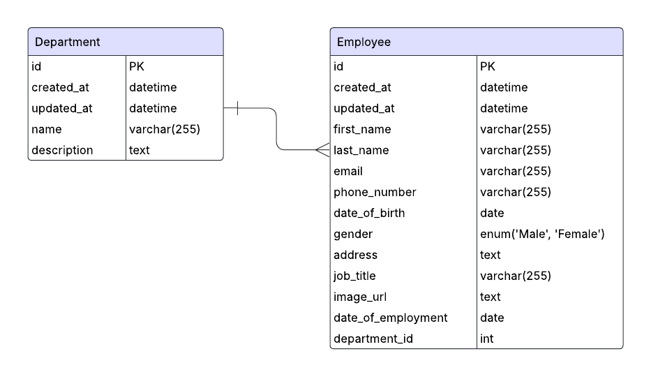

# Employee Directory Backend

## Overview
Serverless (AWS Lambda) backend built with TypeScript, TypeORM, MySQL, and AWS Secrets Manager. Provides CRUD APIs for Departments and Employees.

## Tech Stack
- Runtime: AWS Lambda (Node.js 16+) via Serverless Framework
- Language: TypeScript (compiled to .build)
- ORM: TypeORM 0.3
- Database: MySQL
- Secrets: AWS Secrets Manager (DB credentials)
- Middleware: middy v4 (json body parser, error handler, validation)
- Validation: yup
- Authentication: Amazon Cognito

## Features
- Department CRUD
- Employee CRUD with relation to Department
- Centralized database connection with singleton + initialization lock
- Request validation middleware

## Database Schema


## Project Structure
```
├── data-source.ts              # TypeORM CLI entry (migrations runner)
├── serverless.ts               # Serverless functions & resources config
├── package.json
├── tsconfig.json / tsconfig.paths.json
├── src
│   ├── libs
│   │   ├── api-gateway.ts      # Types for API Gateway events
│   │   ├── handler.ts          # Generic handler wrapper (if any)
│   │   ├── response.ts         # HTTP response helper
│   │   └── validation.ts       # middy wrapper + validation middleware
│   └── modules
│       ├── shared
│       │   └── services
│       │       ├── secret-manager.service.ts   # AWS Secrets Manager access
│       │       ├── congito.service.ts          # Amazon Cognito
│       │       └── db.service.ts
│       ├── department
│       │   ├── department.entity.ts
│       │   ├── department.dto.ts
│       │   ├── department.schema.ts
│       │   ├── department.service.ts
│       │   ├── department.ts               # Lambda handlers
│       │   └── routes.ts                   # Function route configs
│       └── employee
│           ├── employee.entity.ts
│           ├── employee.dto.ts
│           ├── employee.schema.ts
│           ├── employee.service.ts
│           ├── employee.ts                 # Lambda handlers
│           └── routes.ts                   # Function route configs
└── .build/ (generated JS output)
```

## Environment Variables
Create `.env.dev` (and others as needed):
```
REGION=aws-region
API_STAGE=api-stage
SECRET_ID=your-secrets-manager-id
```

## Installation
```
npm install
```

## Running Locally
```
npm run start:dev
```
This runs `serverless offline` with `NODE_ENV=dev`.

## Endpoints:
### Departments
```
GET    /departments
  → Returns a list of departments.

POST   /departments
  Body: { "name": "Engineering", "description": "Engineering dept" }

PUT    /departments/{id}
  Body: { "name": "Design", "description": ", "description": "Engineering dept" }

DELETE /departments/{id}
```
### Employees
```
GET    /employees
  → Returns a list of employees.

POST   /employees
  Body: {
    "firstName": "John",
    "lastName": "Doe",
    "email": "john.doe@test.com",
    "phoneNumber": "123456789",
    "gender": "Male",
    "dateOfBirth": "1994-01-01",
    "departmentId": "1",
    "jobTitle": "Software Engineer",
    "address": "Address",
    "imageUrl": "/path-to-image",
    "dateOfEmployment": "2025-01-01"
  }

PUT    /employees/{id}
  Body: {
    "firstName": "John",
    "lastName": "Doe",
    "email": "john.doe@test.com",
    "phoneNumber": "123456789",
    "gender": "Male",
    "dateOfBirth": "1994-01-01",
    "departmentId": "1",
    "jobTitle": "Software Engineer",
    "address": "Address",
    "imageUrl": "/path-to-image",
    "dateOfEmployment": "2025-01-01"
  }

DELETE /employees/{id}
```
```
All endpoints require a valid Authorization: Bearer <access_token>.
```

## Migrations
Migrations run against the TS source using ts-node.

Scripts:
```
# Create migrations
npm run migration:create src/migrations/file-name

# Generate migration based on your entity
npm run migration:generate src/migrations/file-name

# Run migrations
npm run migration:run

# Revert migrations
npm run migration:revert

# Check migration status
npm run migration:show
```

## Deployment
```
npm run deploy:dev
```